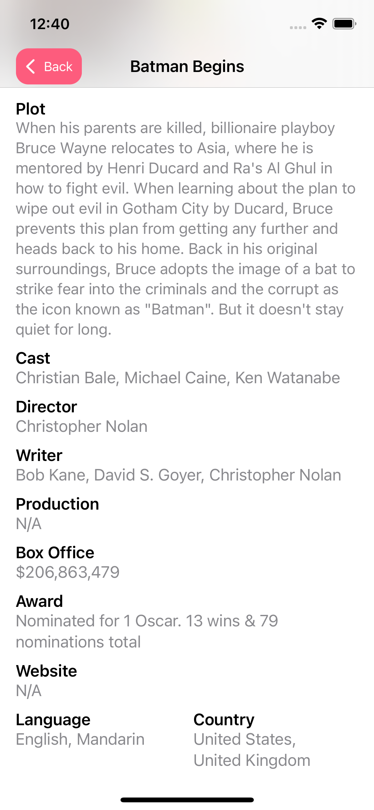

# Movie Diary 🚀
This app was developed by Can Bi. It uses SwiftUI and is written 100% in Swift. The project benefits from multi-threading, publishers/subscribers, and data persistance.

### Movie API
The app uses [OMDb API](http://omdbapi.com/). 
The Open Movie Database
The OMDb API is a RESTful web service to obtain movie information, all content and images on the site are contributed and maintained by our users.

### Implemented Features
- [x]  Data Structure
- [x]  Networking with Combine and URLSession
- [x]  Downloading and caching images
- [x]  Custom NavigationLink for lazy loading
- [x]  ScrollView with Lazy Loading
- [x]  Image Zoom Pop-up
- [x]  Settings page
- [x]  Theme color settings
- [x]  Filtering
- [x]  Paging
- [x]  Favorites
- [x]  Filtering for favorites
- [x]  Offline usage capability with CoreData and Directory File
- [x]  Offline UI State
- [x]  App icon and Launch Screen

### Dark UI Screenshots
  
### Light UI Screenshots

